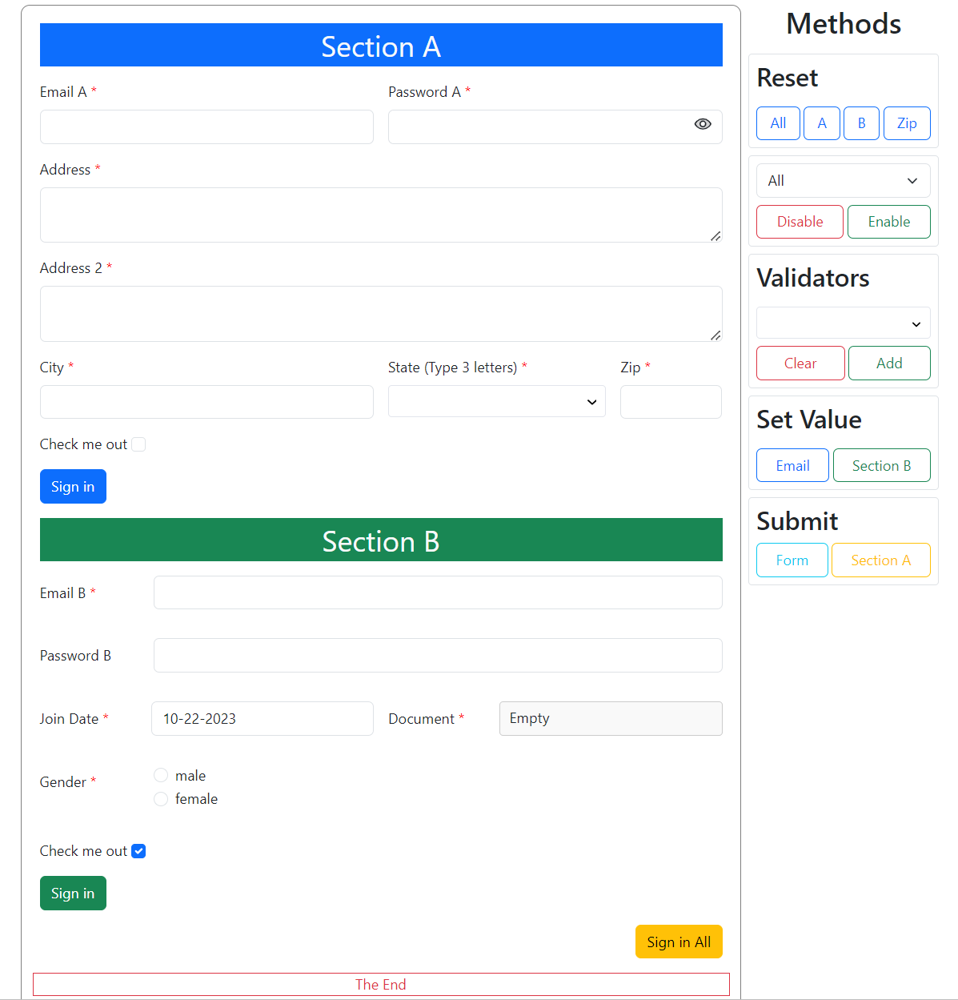
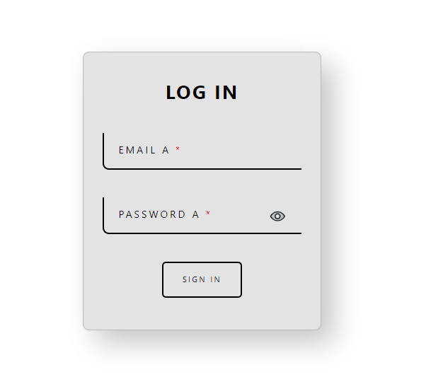
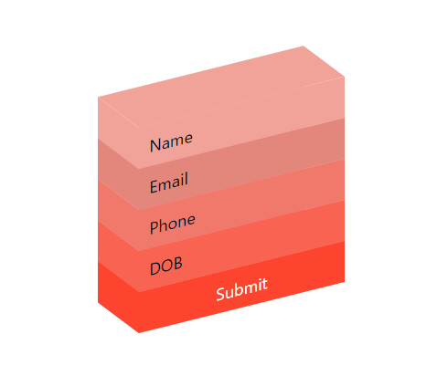
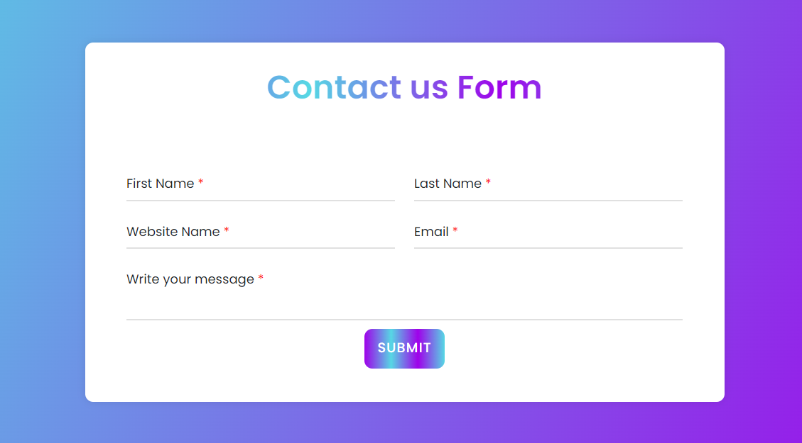

# ng-dyno-form Library

Build Dynamic Reactive Forms in Angular with Ease!

The **ng-dyno-form** library allows you to create dynamic reactive forms in Angular with ease. It offers a wide range of customization options and methods to build forms tailored to your needs.

## Features

1. **Field Types**: Create various types of fields including text, number, password, email, radio, checkbox, select, textarea, button, heading, date, daterange, and file.

2. **Mandatory Fields**: Define fields as mandatory, ensuring users provide necessary information.

3. **Validation Patterns**: Set validation patterns for fields to ensure data integrity.

4. **Error and Validation Messages**: Customize error messages for validation errors.

5. **Class Customization**: Add custom CSS classes to labels, fields, and parent elements for unique designs.

6. **Labels**: Include labels for each field to provide context to users.

7. **Placeholders**: Set placeholders to guide users on expected input.

8. **Field Disabling**: Disable fields as needed.

9. **Conditional Field Visibility**: Hide fields based on specified conditions.

10. **Custom Properties**: Configure properties like minDate, maxDate or multi-select based on field type.

11. **Section-Based Validation**: Perform validation and submit forms section by section.

12. **Form Control Methods**: Utilize methods to set, patch, or clear values, enable or disable fields, add or clear validations and handle form and section submissions.

13. **Event Handling**: Capture various events including file change, input, focus, blur, click, and change events.

## Documentation Sections

1. [Installation](#installation)
2. [Usage](#usage)
3. [Configuration](#configuration)
4. [Form Creation](#form-creation)
5. [Field Customization](#field-customization)
6. [Event Handling](#event-handling)
7. [Methods](#methods)
8. [Examples](#examples)
9. [API Reference](#api-reference)

## Installation

Install the **ng-dyno-form** library via npm:

```bash
npm install ng-dyno-form
```

Install the peer dependencies via npm:

```bash
ng add ngx-bootstrap
npm i @ng-select/ng-select
```

## Usage

Add the `styles.css` file from **ng-dyno-form** and other necessary stylesheets in `angular.json`.

```css
@import "node_modules/ng-dyno-form/assets/styles.css";
```

```json
  ...,
  "styles": [
    "./node_modules/ng-dyno-form/assets/styles.css",
    "./node_modules/ngx-bootstrap/datepicker/bs-datepicker.css",
    "./node_modules/bootstrap/dist/css/bootstrap.min.css",
    ...
  ],
```

Import the `NgDynoFormModule` module in your Angular application and start building dynamic forms quickly.

```typescript
import { NgDynoFormModule } from 'ng-dyno-form';

@NgModule({
  declarations: [...],
  imports: [NgDynoFormModule, ...],
  ...
})
export class YourModule { }
```

## Configuration

To configure your dynamic form, create a `DynoFormConfig` array with the desired field settings. Each field can have properties such as `name`, `type`, `label`, `required`, and more. Refer to the [DynoFormConfig Interface](dyno-form-config.md) for details.

Here's an example of how you can configure the fields in DynoFormConfig:

```typescript
const fieldConfig: DynoFormConfig[] = [{
  name: 'gender',
  type: 'select',
  label: 'Gender',
  required: true,
  class: 'form-control',
  parentClass: 'form-group',
  labelClass: 'control-label',
  value: 'male',
  section: 'User Information',
  extra: {
    validationMessages: {
      required: 'Gender is required.',
    },
    options: [
                { name: 'male', id: 'male' },
                { name: 'female', id: 'female' },
                { name: 'other', id: 'other' }
    ],
    key: 'id',
    label: 'name',
    multi: false
  },
  disable: false,
  condition: (field) => {
    // Your custom logic to determine whether to show or hide the field.
    return true;
  }
}];
```

## Form Creation

To create a dynamic form using the **ng-dyno-form** library, create a `dyno-form` tag and bind it to your `DynoFormConfig` array.

```html
<dyno-form [config]="formConfig" [mainClass]="formClass" (callBack)="callBackActions($event)" #f1>
  <!-- content to project-->
</dyno-form>
```

## Field Customization

Customize each field with options like validation patterns, error messages, CSS classes, and more directly within the `DynoFormConfig`.

## Event Handling

### `callBack` Event

The `callBack` event is emitted by the **ng-dyno-form** library to notify you of various events within the dynamic form. It provides structured data in the following format:

| Property  | Description                                     |
| --------- | ----------------------------------------------- |
| `type`    | The type of event (e.g., "file", "input", "focus", "blur", "click", "change"). |
| `event`   | The corresponding event data (e.g., `$event` values). |
| `section` | The section to which the field belongs. |
| `name`    | The form control key of the field. |

Here's an explanation of each property:

- `type`: Describes the type of event that occurred in the dynamic form, such as a change in a file input, an input event, focus event, blur event, click event, or change event.

- `event`: Provides the specific event data associated with the event type. For example, for a "file change" event, it may contain details about the selected file.

- `section`: Indicates the section within the form to which the field belongs.

- `name`: Represents the form control key (name) of the field that triggered the event.

Declaration of callBack event is given [here](#form-creation).
Here's an example of how to listen for and handle the `callBack` event:

```typescript
callBackActions(e:any) {
  console.log('Received event:', e.type);
  console.log('Event data:', e.event);
  console.log('Field section:', e.section);
  console.log('Field name:', e.name);
  // Handle the event as needed
});
```

## Methods

Define validation patterns and error messages for each field to ensure data accuracy. Handle form validation and submission section by section.

Here are the methods available in the DynoForm library:

| Method                   | Input Arguments                        | Description                                      |
| ------------------------ | --------------------------------------- | ------------------------------------------------ |
| `addValidation`          | `validation: any[], ...ctrls: string[]` | Adds validation rules to specified form controls. |
| `clearValidation`        | `...ctrls: string[]`                    | Clears validation rules from specified form controls. |
| `setValue`               | `ctrl: string, value: any`              | Sets the value of a form control. |
| `patchValue`             | `obj: any`                              | Patches the values of multiple form controls based on an object. |
| `resetValue`             | `type: 'section'\|'all', ...ctrls: any` | Resets the values of specified form controls or sections. <br/> * If type is 'section' => 'ctrls' is section name. <br/> * If type is 'all' => 'ctrls' is formcontrol field names, if undefined then all fields. |
| `disableField`           | `...ctrls: any`                         | Disables specified form controls. |
| `enableField`            | `...ctrls: any`                         | Enables specified form controls. |
| `sectionValidator`       | `section?: string`                     | Runs validation for a specific section (fields with no section if '' or all sections if not specified (undefined)). |
| `sectionSubmit`          | `section: string`                       | Initiates the submission process for a specific section. |

### Method Usage

Here's an example of how to use the methods in your code:

```typescript
import { DynoFormConfig } from 'ng-dyno-form/lib/ng-dyno-form-config.model';


export class DemoComponent {
  @ViewChild('f1') dynoform!:NgDynoFormComponent;

  // Example usage of some methods
  this.dynoForm.addValidation([Validators.required], 'fieldName');
  this.dynoForm.setValue('fieldName', 'New Value');
  this.dynoForm.disableField('fieldName1', 'fieldName2');
}
```

## Examples

For detailed examples and live demos, visit our [StackBlitz Demo](https://stackblitz.com/edit/stackblitz-starters-ugmphw?file=src%2Fmain.ts) or view example images below.

### Sample Forms






## API Reference

For a complete reference of the `DynoFormConfig` interface, see the [API Reference](dyno-form-config.md).

## License

This library is licensed under the [MIT License](LICENSE).

---
